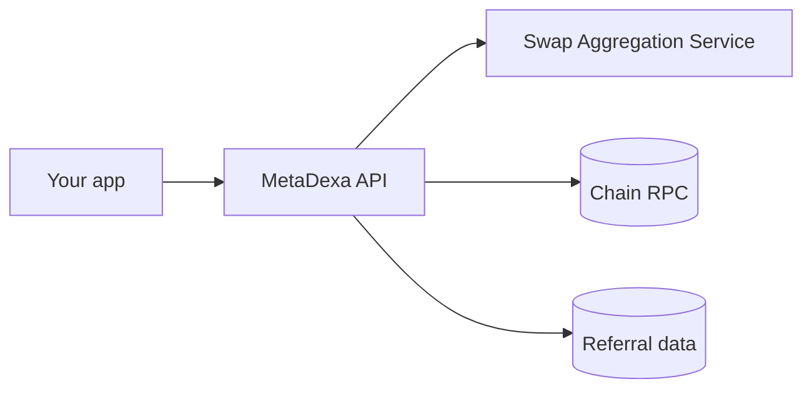

## The big picture

Your app talks to one API. The API queries the Swap Aggregation Service, reads the chain, and keeps referral records.

## The parts

| Part | What it does |
| --- | --- |
| Quote engine | Asks the Swap Aggregation Service for routes, picks the best, builds the transaction. |
| Gasless engine | Same quotes, but a relayer submits and pays gas. The fee is taken in the token you pay with. |
| Referral logic | Registers referrers, records swaps, awards points once a swap is confirmed on-chain. |
| MetaSwap router | MetaDexa's own contract. Swaps go through it where it's deployed. |
| Background check | An hourly job confirms pending referral swaps against the chain. |

## What the API does not do

- It never holds your funds or keys.
- It does not send swaps for you, except gasless swaps through the relayer.
- Quotes are not reserved. Prices can move before you send.

## Swap Aggregation Service

The Swap Aggregation Service supplies routes and prices. It also supplies the USD prices used for referral volume.

If some sources are down, the others still answer. If none answer you get a `500`. See [Errors](/errors).

## Where to go next

- [How requests flow](/flows) for step-by-step paths.
- [Referrals](/referrals) for the referral lifecycle.
