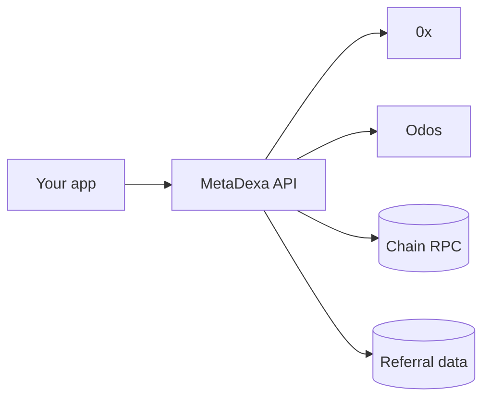

## The big picture

Your app talks to one API. The API fans out to providers, reads the chain, and keeps referral records.

## The parts

| Part | What it does |
| --- | --- |
| Quote engine | Asks 0x and Odos for a route, picks the best, builds the transaction. |
| Gasless engine | Same quotes, but a relayer submits and pays gas. The fee is taken in the token you pay with. |
| Referral logic | Registers referrers, records swaps, awards points once a swap is confirmed on-chain. |
| MetaSwap router | MetaDexa's own contract. Swaps go through it where it's deployed. |
| Background check | An hourly job confirms pending referral swaps against the chain. |

## What the API does not do

- It never holds your funds or keys.
- It does not send swaps for you, except gasless swaps through the relayer.
- Quotes are not reserved. Prices can move before you send.

## Providers

| Provider | Used for |
| --- | --- |
| 0x | Quotes, and USD prices for referral volume. Always queried. |
| Odos | Quotes. Skipped on chain `10`. |

If one provider is down, the other still answers. If both are down you get a `500`. See [Errors](/errors).

## Where to go next

- [How requests flow](/flows) for step-by-step paths.
- [Referrals](/referrals) for the referral lifecycle.
