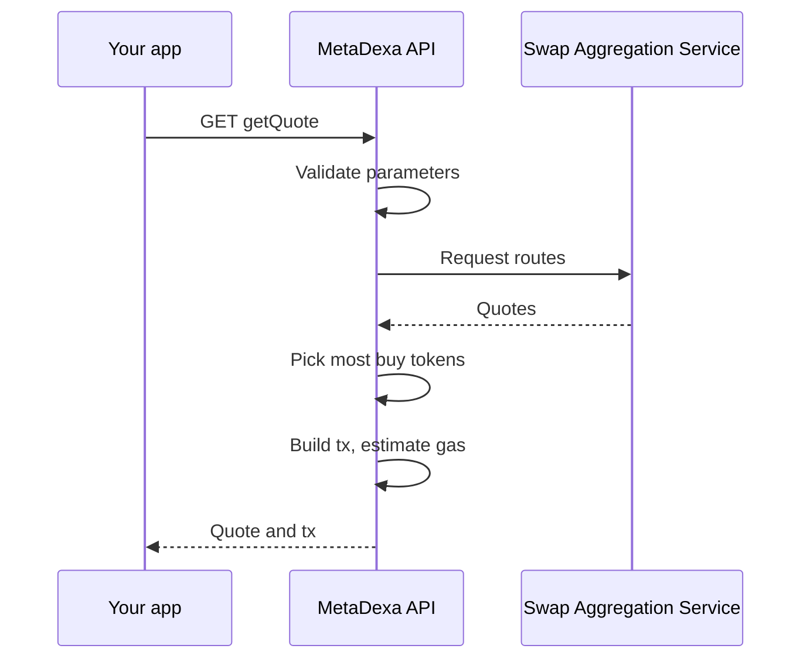
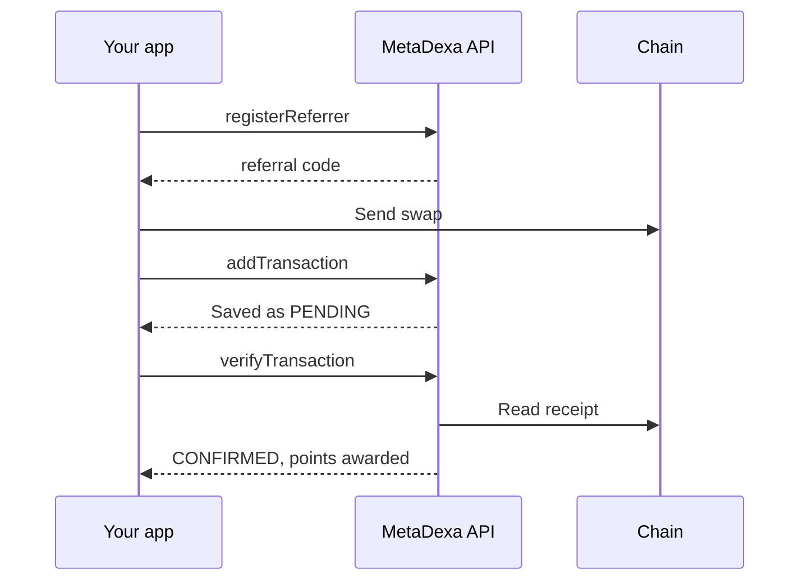

## Quote

1. The API checks your parameters. A bad one returns a `400`.
2. The Swap Aggregation Service is asked for routes from its sources. On chain `10` only some sources are available.
3. The quote with more buy tokens wins. A tie goes to the lower gas estimate.
4. Unless `skipValidation=true`, the API builds the transaction and estimates gas. If the chain has a MetaSwap router, the call goes through it. Otherwise you get the provider's own transaction.
5. You get the quote, or a `500` if nothing worked.

## Gasless quote

Same path, with differences:

1. Only a single route source is used.
2. A fee is charged in the token you pay with. On chains with a free-swaps campaign the fee is zero.
3. The API prices that fee with a second quote.
4. Unless `skipValidation=true`, it builds the call data, signs it with the relayer, and simulates it.

Errors:
- `400`: amount too small to cover the fee, a fee token that isn't accepted, or calldata that couldn't be built.
- `500`: gas price lookup or signing failed.

<Note>
`getGaslessQuote` is served by the legacy service, and v2 answers `404` for it. In production the gateway sends that path to legacy, so callers still get gasless quotes.
</Note>

## Referral swap

If you never call `verifyTransaction`, the hourly job picks the swap up for up to 48 hours. Details are in [Referrals](/referrals).

## Sources

These flows come from the backend's own docs: `docs/ai/ARCHITECTURE.md` (flows A to C) and `METADEXA_ARCHITECTURE.MD` in the API repository.
