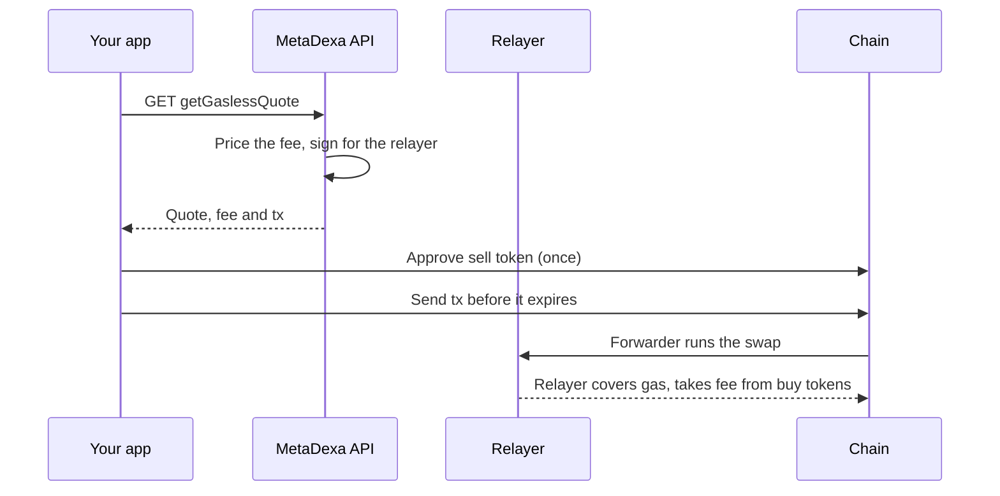

A gasless swap is a normal swap where a relayer pays the network gas. You pay the fee out of the tokens you receive.

## The flow



## 1. Get a gasless quote

```bash
curl "https://api.metadexa.io/v1.0/137/getGaslessQuote?\
sellTokenAddress=0x1111111111111111111111111111111111111111&\
buyTokenAddress=0xeeeeeeeeeeeeeeeeeeeeeeeeeeeeeeeeeeeeeeee&\
sellTokenAmount=1000000000000000000&\
slippage=0.01&\
fromAddress=0x4444444444444444444444444444444444444444&\
skipValidation=false"
```

The response:

```json
{
  "estimatedGas": 240000,
  "paymentTokenAddress": "0x0d500b1d8e8ef31e21c99d1db9a6444d3adf1270",
  "paymentFees": "0",
  "buyTokenAddress": "0x0d500b1d8e8ef31e21c99d1db9a6444d3adf1270",
  "buyAmount": "63179691357410456145",
  "sellTokenAddress": "0x14af1f2f02dccb1e43402339099a05a5e363b83c",
  "sellAmount": "1000000000000000000000",
  "allowanceTarget": "0x6afD834f6e3D5ad5A83E7838ca45F3DBDe3E323d",
  "tx": {
    "from": "0x4444444444444444444444444444444444444444",
    "to": "0x3333333333333333333333333333333333333333",
    "data": "0x",
    "gas": 315000,
    "value": "0",
    "gasPrice": "124324285671"
  }
}
```

(Values are fake.)

Set `skipValidation=true` to get a price only. You won't get `tx`.

## 2. What you sign

Nothing extra at quote time. The API creates the relayer's signature and builds it into `tx.data`. Your wallet signs and sends `tx` as usual.

The signature covers the chain, your address, the fee, the amount and an expiry. Change any of it and the swap reverts. So don't edit `tx`.

## 3. Approve the sell token

If you sell a non-native token, approve `allowanceTarget` first. See [token approvals](/swap-guide#token-approvals).

## 4. Send before it expires

A gasless quote is valid for **10 minutes**. After that the signature is rejected. Get a new quote.

## What the relayer pays

| Cost | Who pays |
| --- | --- |
| Network gas | The relayer |
| The fee, `paymentFees` | You, in `paymentTokenAddress` |

`paymentTokenAddress` is the token you buy. The fee follows the gas price and estimated gas, plus a fixed overhead.

On chains running a free-swaps campaign, `paymentFees` is `"0"`.

## Errors

| Status | Cause | Fix |
| --- | --- | --- |
| `400` | Amount too small to cover the fee | Sell more |
| `400` | Fee token not accepted | Pick another buy token |
| `400` | Calldata couldn't be built | Check the parameters, then retry |
| `500` | Gas price or signing failed | Retry with backoff |

More in [Errors](/errors).
